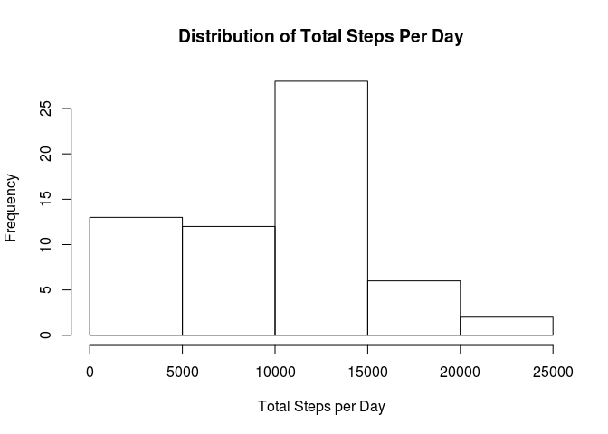
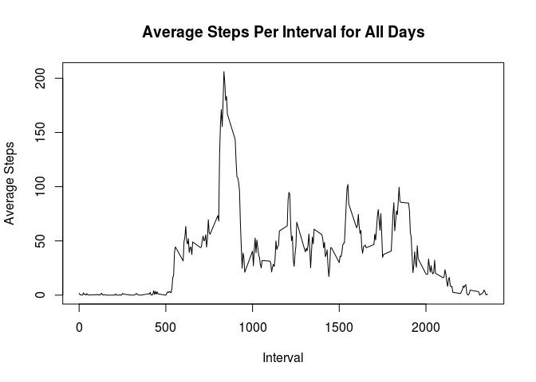
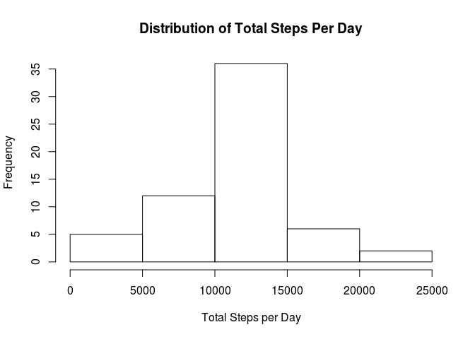
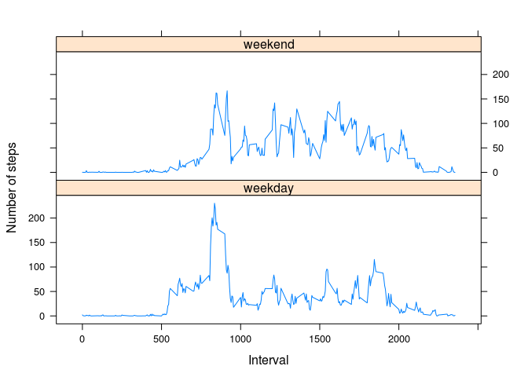

# Reproducible Research: Peer Assessment 1
## Loading and preprocessing the data
### Load the data
#### *Note*: No pre-processing required at this point

```r
steps<-read.csv('activity.csv')
head(steps)
```

```
##   steps       date interval
## 1    NA 2012-10-01        0
## 2    NA 2012-10-01        5
## 3    NA 2012-10-01       10
## 4    NA 2012-10-01       15
## 5    NA 2012-10-01       20
## 6    NA 2012-10-01       25
```
## What is mean total number of steps taken per day?
### Calculate the total number of steps taken per day
#### *Note*: Data for the first few days are displayed

```r
total_steps_per_day<-setNames(aggregate(steps$steps,na.rm=TRUE,by=list(steps$date),FUN=sum), c('Date', 'TotalSteps'))
head(total_steps_per_day)
```

```
##         Date TotalSteps
## 1 2012-10-01          0
## 2 2012-10-02        126
## 3 2012-10-03      11352
## 4 2012-10-04      12116
## 5 2012-10-05      13294
## 6 2012-10-06      15420
```
### Make a histogram of the total number of steps taken each day

```r
hist(total_steps_per_day$TotalSteps,main="Distribution of Total Steps Per Day", xlab="Total Steps per Day")
```

 

### Calculate and report the mean and median of the total number of steps taken per day.

```r
print(mean(total_steps_per_day$TotalSteps))
```

```
## [1] 9354.23
```

```r
print(median(total_steps_per_day$TotalSteps))
```

```
## [1] 10395
```

## What is the average daily activity pattern?
### Make a time series plot (i.e. type = "l") of the 5-minute interval (x-axis) and the average number of steps taken, averaged across all days (y-axis).
#### *Note*: First, I calculate and save the average steps per interval across all days into a new variable

```r
avg_steps_by_int<-setNames(aggregate(steps$steps,na.rm=TRUE,by=list(steps$interval),FUN=mean), c('interval', 'steps'))
```
#### Now I plot the data.

```r
plot(avg_steps_by_int$interval,y=avg_steps_by_int$steps,type="l",xlab='Interval',ylab='Average Steps',main='Average Steps Per Interval for All Days')
```

 

### Which 5-minute interval, on average across all the days in the dataset, contains the maximum number of steps?
#### *Note*: From the plot, it appears the highest number is somewhere in the range 800-850. To find the exact value, we can use the order function to sort the data in decreasing order by the average number of step and display the first few rows, as shown below. The top interval is number 835, with an average of just over 206 steps.

```r
avg_steps_by_int[order(-avg_steps_by_int[,2]),][1:5,]
```

```
##     interval    steps
## 104      835 206.1698
## 105      840 195.9245
## 107      850 183.3962
## 106      845 179.5660
## 103      830 177.3019
```

## Imputing missing values
### Calculate and report the total number of missing values in the dataset 
#### *Note*: There are different ways to do this. Perhaps the clearest way is to subtract the number of rows that do not include NA from the total number of rows in the original data set, as shown below.

```r
NROW(steps) - NROW(na.omit(steps))
```

```
## [1] 2304
```

### Devise a strategy for filling in all of the missing values in the dataset.
#### *Note*: My strategy is to replace the NA step values with the mean value for their 5-minute intervals. Using the avg_steps_by_int data frame created above as a lookup table, it's easy to replace NA values with the average value for the matching 5-minute intervals.

### Create a new dataset that is equal to the original dataset but with the missing data filled in.
#### *Note*: This step is accomplished by looping through the avg_steps_by_int data frame and assigning the average steps value for each interval to NA rows in the dataset, based on matching interval values. A new copy of the steps data frame (steps2) is used here. The first few rows of the new data set are displayed below.

```r
steps2 <- steps
for(i in 1:nrow(avg_steps_by_int)) {
    j<-avg_steps_by_int[i,1]
    k<-avg_steps_by_int[i,2]
    steps2$steps[is.na(steps2$steps) & steps2$interval==j] <- k
}
head(steps2)
```

```
##       steps       date interval
## 1 1.7169811 2012-10-01        0
## 2 0.3396226 2012-10-01        5
## 3 0.1320755 2012-10-01       10
## 4 0.1509434 2012-10-01       15
## 5 0.0754717 2012-10-01       20
## 6 2.0943396 2012-10-01       25
```

### Make a histogram of the total number of steps taken each day. Calculate and report the mean and median total number of steps taken per day. Do these values differ from the estimates from the first part of the assignment? What is the impact of imputing missing data on the estimates of the total daily number of steps?
#### *Note*: First, the total steps is calculated per day, and that data is then plotted in a histogram and the mean and median calculated and displayed. Replacing the NA values with the average value for the respective intervals has clearly increased the estimates of steps per day and made the distribution much more normal, as seen in both the histogram and the averages computed and displayed below.

```r
total_steps_per_day2<-setNames(aggregate(steps2$steps,by=list(steps2$date),FUN=sum), c('Date', 'TotalSteps'))
head(total_steps_per_day2)
```

```
##         Date TotalSteps
## 1 2012-10-01   10766.19
## 2 2012-10-02     126.00
## 3 2012-10-03   11352.00
## 4 2012-10-04   12116.00
## 5 2012-10-05   13294.00
## 6 2012-10-06   15420.00
```

```r
hist(total_steps_per_day2$TotalSteps,main="Distribution of Total Steps Per Day", xlab="Total Steps per Day")
```

 

```r
print(mean(total_steps_per_day2$TotalSteps))
```

```
## [1] 10766.19
```

```r
print(median(total_steps_per_day2$TotalSteps))
```

```
## [1] 10766.19
```

## Are there differences in activity patterns between weekdays and weekends?
### Create a new factor variable in the dataset with two levels – “weekday” and “weekend” indicating whether a given date is a weekday or weekend day.
#### *Note*: Using the lubridate library, first convert the dates to Date objects. Then use the ifelse and weekdays functions to add the appropriate levels to a new column. A new copy of the dataset (steps3) is used here.

```r
library(lubridate)
steps3<-steps2
steps3$date<-ymd(steps3$date)
steps3['daytype']<-ifelse(weekdays(steps3$date,abbreviate=TRUE) %in% c('Sat', 'Sun'), 'weekend', 'weekday')
head(steps3)
```

```
##       steps       date interval daytype
## 1 1.7169811 2012-10-01        0 weekday
## 2 0.3396226 2012-10-01        5 weekday
## 3 0.1320755 2012-10-01       10 weekday
## 4 0.1509434 2012-10-01       15 weekday
## 5 0.0754717 2012-10-01       20 weekday
## 6 2.0943396 2012-10-01       25 weekday
```

#### Next, calculate and save the average steps per interval by 'weekday' and 'weekend' into a new variable, avg_steps_by_int_daytype.

```r
avg_steps_by_int_daytype<-setNames(aggregate(steps3$steps,na.rm=TRUE,by=list(steps3$interval,steps3$daytype),FUN=mean), c('interval','daytype','steps'))
head(avg_steps_by_int_daytype)
```

```
##   interval daytype      steps
## 1        0 weekday 2.25115304
## 2        5 weekday 0.44528302
## 3       10 weekday 0.17316562
## 4       15 weekday 0.19790356
## 5       20 weekday 0.09895178
## 6       25 weekday 1.59035639
```

### Make a panel plot containing a time series plot (i.e. type = "l") of the 5-minute interval (x-axis) and the average number of steps taken, averaged across all weekday days or weekend days (y-axis).
#### *Note*: Using the lattice library, we can plot weekday and weekend averages per interval.

```r
library(lattice)
xyplot(steps ~ interval | daytype, 
           data = avg_steps_by_int_daytype,
           type = "l",
           xlab = "Interval",
           ylab = "Number of steps",
           layout=c(1,2))
```

 
